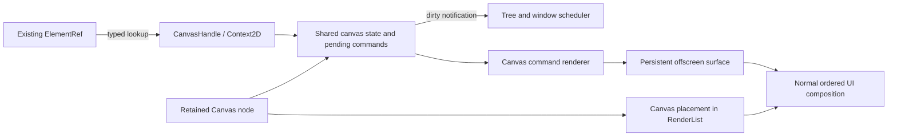

# Canvas 2D API proposal

Status: approved for implementation on 2026-09-10. Implementation is in the separate `codex/canvas-2d` worktree.

## Implementation record

The review proposal below is retained as the design history. The [Canvas 2D guide](../docs/src/content/docs/canvas.md) documents the implemented API and takes precedence over proposed signatures or options below.

The implementation keeps the agreed entry point: `ctx.element_ref()` / `.ref_element(...)` -> `as_canvas()` -> owned `context_2d()`. No separate ref type or required drawing callback was added.

The initial CPU prototype was replaced following the performance review. The current implementation uses the approved shared command/state design with native GPU execution on **both WGPU and DX12**.

- **Execution:** one persistent premultiplied RGBA8 texture per canvas; CPU path tessellation; GPU source-over drawing; shared 512 × 512 MSAA scratch for touched tiles. No full-size CPU backing or changed-canvas uploads in the default mode.
- **Memory:** immutable image references and shared vector clip chains; bounded command bytes/count, clip geometry, tessellation expansion, text shaping/glyph caches, GPU source caches, and explicit readbacks. GPU resources remain alive through their submission fences.
- **Refs/threading:** the original owned ref/context API is unchanged. Calls serialize; application coordination is needed for multi-call sequences. Painting wakes the existing window waker without invalidating layout.
- **Sizing:** same-size rerenders retain pixels; logical resize resets state/path/pixels; scale-only resize resamples on GPU and keeps logical vector clips. Metrics observers retain the original contract.
- **Snapshots:** `snapshot()` now returns a `CanvasReadback` ticket, with `try_take()` and worker-side `wait_timeout()`. Requests are ordered with drawing, including when the node is culled. There are two outstanding requests per canvas and eight process-wide. DX12 submits at readback barriers to keep copies ahead of later rendering/fast clears.
- **Detachment/recovery:** GPU drawing after removal is rejected. Backing textures are retired safely; old handles never retarget. Device loss reports an error and requires application repaint rather than replaying an unbounded command history.
- **Software:** `Canvas::new().software()` explicitly selects the CPU reference and its immediate snapshots. Unsupported custom GPU renderers report `UnsupportedBackend`; renderer wrappers must forward `prepare_canvases`.
- **Diagnostics:** `CanvasStatus` reports charged pending bytes, persistent backing bytes, cumulative batches/vertices/tiles/source uploads, and errors. The ordinary node presentation still supplies background, borders, radius, transform, and inherited opacity.

The supported drawing subset is unchanged: solid styles, source-over alpha, save/restore, transforms, rectangles, paths/arcs/curves, fill rules, dashes, clipping, hit testing, single-line text, and immutable image crops. The [guide](../docs/src/content/docs/canvas.md) describes limits and deliberate browser differences. The [performance record](canvas-gpu-performance.md) contains measurements and reproduction commands.

Validation covers the existing 28 software lifecycle/semantic tests, bounded queue/readback tests, a GPU pixel comparison against the reference, and native WGPU/DX12 captures with tile boundaries, ordered readback, hidden drawing, scale preservation, and resource retirement. The guide and checks are updated for the asynchronous snapshot API.

---

## Approved review proposal (historical)


Date: 2026-09-10. Repository baseline: lurq 0.18.0.

Suggested review order: read the API examples, lifecycle and sizing rules, then the decision table. The remaining sections explain implementation consequences and verification.

- [API and ref access](#4-public-types-and-ref-access)
- [Application examples](#5-application-examples-and-first-access)
- [Lifecycle and reconciliation](#6-lifecycle-and-reconciliation)
- [Layout and resize](#7-layout-coordinates-resize-and-display-scale)
- [Drawing API and semantics](#8-drawing-api-surface)
- [Repaint scheduling](#12-repaint-scheduling-and-reactive-state)
- [Rendering architecture](#13-rendering-architecture)
- [Verification and implementation stages](#16-verification-plan-for-implementation)
- [Decisions to review](#18-decisions-to-review)

## 1. The proposed experience

Add a `Canvas` component that participates in lurq layout, styling, input, and rendering. Access its drawing context through the existing element ref, then draw from component methods, input handlers, timers, or other application code.

```rust
// Proposed Canvas and as_canvas APIs; this does not compile on lurq 0.18.0.
let canvas_ref = ctx.element_ref();

Canvas::new()
  .ref_element(canvas_ref.clone())
  .width(480.0)
  .height(240.0)
```

After the element is attached:

```rust
if let Some(canvas) = canvas_ref.as_canvas() {
  let draw = canvas.context_2d();

  draw.set_fill_style("#60a5fa");
  draw.fill_rect(20.0, 20.0, 100.0, 60.0);
}
```

`Context2D` is an owned, cloneable handle. Obtaining it does not borrow a component, tree, render pass, or GPU device. Application code can retain it after this block and use it without an `on_draw` callback.

The recommended model is persistent drawing: commands modify the canvas's existing contents. Calling `fill_rect` twice draws two rectangles; an ordinary component rerender does not erase either one. An explicit clear or reset changes the existing pixels.

## 2. What is agreed and what is proposed

The following direction was accepted in the discussion:

- Provide a browser-like 2D drawing API in lurq.
- Reuse `ctx.element_ref()` and `.ref_element(...)`.
- Add a typed `as_canvas()` accessor to the existing ref.
- Allow access to a retainable drawing context outside a drawing callback.
- Do not require a separate `CanvasRef` or `ctx.canvas_ref()` API.

Everything else in this document is a recommendation for review, including persistent bitmap behavior, sizing, defaults, threading, feature scope, and implementation stages. API sketches describe the intended interface, not existing methods or a commitment to every exact type name.

The review should first settle the decisions in [section 18](#18-decisions-to-review), especially resize behavior, detached contexts, and the first release scope.

## 3. Goals and boundaries

The primary uses are charts, diagrams, drawing tools, image annotations, visualizations, and custom controls that benefit from direct drawing. Canvas should also permit simple animation without forcing a component rebuild for every frame.

The design should provide:

- Familiar drawing operations and predictable command order.
- Stable canvas content and context identity across compatible reconciliation.
- Automatic repaint scheduling after visible changes.
- Local logical coordinates and automatic display scale handling.
- Integration with both WGPU and DX12.
- Reuse of lurq geometry, colors, text, and image facilities where their semantics fit.
- Explicit behavior for unavailable refs, resize, detachment, and backend failure.

A canvas is one UI node. Individual drawn shapes do not become components, acquire layout slots, receive automatic events, or appear as independent accessible controls. Applications can overlay normal lurq elements for editing, focus, labels, and toolbars.

This proposal does not include WebGL/WebGPU contexts, JavaScript execution, HTML parsing, a browser compatibility guarantee, an editor scene graph, or application undo/redo. A later scene library can retain shapes and redraw them through this API.

## 4. Public types and ref access

### 4.1 Existing refs remain the entry point

Lurq currently has two different types named `ElementRef`:

| Existing type | Role | Proposed canvas access |
| --- | --- | --- |
| `core::ElementRef` | Owned handle returned by `ctx.element_ref()` and attached through `.ref_element(...)`. | `as_canvas() -> Option<CanvasHandle>` |
| `core::ElementRefMut` | Owned handle with bounds mutation support. | Same accessor, delegating to its shared ref state. |
| `node::ElementRef<'_>` | Borrowed view used while inspecting the retained tree. | Same accessor returning an owned `CanvasHandle`. |

`as_canvas()` checks the attached node's capability. It does not search descendants, infer canvas identity from an `id`, or convert an arbitrary node into a canvas.

Access through a borrowed tree view should produce the same surface identity as access through an attached owned ref. The returned handle must outlive the tree-view borrow safely.

Conceptual signatures:

```rust
impl ElementRef {
  pub fn as_canvas(&self) -> Option<CanvasHandle>;
}

#[derive(Clone)]
pub struct CanvasHandle { /* owned reference to one canvas surface */ }

impl CanvasHandle {
  pub fn context_2d(&self) -> Context2D;
  pub fn surface_id(&self) -> CanvasId;      // Stable opaque identity.
  pub fn size(&self) -> Size;                 // Logical content size.
  pub fn pixel_size(&self) -> (u32, u32);    // Backing storage dimensions.
  pub fn scale_factor(&self) -> f32;
  pub fn is_attached(&self) -> bool;
  pub fn status(&self) -> CanvasStatus;
}

#[derive(Clone)]
pub struct Context2D { /* owned reference to the same surface */ }

impl Context2D {
  pub fn canvas(&self) -> CanvasHandle;     // Size/status access from a saved context.
}
```

`CanvasId` is an opaque, comparable, copyable surface identifier, distinct from an element's author-supplied string `id` and its runtime `NodeId`. Resize changes metrics/content revisions, not `CanvasId`; replacement creates a new `CanvasId`.

`CanvasHandle` is the typed result of an existing ref lookup, not another kind of ref users must create or attach. A typed result keeps drawing methods off unrelated elements and gives room for canvas size and status queries.

The generic ref's name does not imply that every capability it exposes is immutable. Drawing through an owned capability is an explicit operation with its own invalidation rules; it must not expose an unrestricted mutable `Node` reference.

### 4.2 Context identity and shared state

Repeated `context_2d()` calls and `Context2D::clone()` refer to the same surface, styles, transform, clip, state stack, and current path.

```rust
let first = canvas.context_2d();
let second = canvas.context_2d();

first.set_fill_style("#ef4444");
second.fill_rect(0.0, 0.0, 20.0, 20.0); // Uses the shared red fill.
```

A clone does not create an independent painter or copy pixels. Reusable drawing helpers should balance `save()` and `restore()`, and explicitly manage their paths.

The recommended methods take `&self` and synchronize their shared internal state. The public intent is `Clone + Send + Sync`, which also fits lurq's existing handler bounds. Cross-thread behavior requires the scheduling and ordering work described below; an `Arc` alone is insufficient.

### 4.3 Ref binding rules

One owned ref binds to one live element at a time. Attaching the same ref to multiple simultaneously live nodes is unsupported. The runtime should diagnose and refuse a conflicting binding, rather than silently making the last traversal win.

Different ref handles may expose the same canvas if obtained through inspection of that node. Canvas surface identity belongs to the retained node, not to the ref object.

Changing `.ref_element(...)` on an otherwise preserved canvas replaces the ref binding without replacing its contents. Reusing the same ref on a newly mounted canvas does not restore an older canvas's contents.

## 5. Application examples and first access

### 5.1 Draw in an event handler

Resolve the ref when the handler runs, not while constructing the initial UI:

```rust
fn render(&self, ctx: &mut Ctx) -> impl Into<Element> {
  let canvas_ref = ctx.element_ref();
  let target = canvas_ref.clone();

  Column::new()
    .child(
      Canvas::new()
        .ref_element(canvas_ref)
        .width(480.0)
        .height(240.0),
    )
    .child(Button::new("Draw rectangle").on_click(move |_| {
      if let Some(canvas) = target.as_canvas() {
        let draw = canvas.context_2d();
        draw.set_fill_style("#60a5fa");
        draw.fill_rect(20.0, 20.0, 100.0, 60.0);
      }
    }))
}
```

The `ctx.element_ref()` slot remains stable when called consistently during component render. Alternatively, create an `ElementRef` once in `Component::create`, store it in the component, and attach its clone on every render. Do not recreate a stored ref on every render.

### 5.2 Initial drawing

The recommended first-ready point is after the initial layout has bound the ref and assigned the canvas's size. Merely constructing `Canvas::new()` does not make its ref available.

Lurq already has `Component::after_layout()` and `ElementRef::observe_rect(...)`. Use a guarded `after_layout()` for initial drawing. Track the actual surface identity or retain the first handle; a single lifetime-wide boolean is insufficient if the canvas can be removed and remounted.

```rust
// Proposed-API example; imports omitted. Ref<T> is lurq's nonreactive cell.
struct Example {
  canvas_ref: ElementRef,
  drawing: Ref<Option<(CanvasId, Context2D)>>,
}

impl Component for Example {
  type Props = ();

  fn create(ctx: &mut Ctx) -> Self {
    Self {
      canvas_ref: ctx.element_ref(),
      drawing: ctx.create_ref(None),
    }
  }

  fn render(&self, _ctx: &mut Ctx) -> impl Into<Element> {
    Canvas::new()
      .ref_element(self.canvas_ref.clone())
      .width(480.0)
      .height(240.0)
  }

  fn after_layout(&self) {
    let Some(canvas) = self.canvas_ref.as_canvas() else { return };
    let id = canvas.surface_id();
    let initialized = self.drawing.with(|saved| {
      saved.as_ref().is_some_and(|(saved_id, _)| *saved_id == id)
    });
    if initialized { return; }

    let draw = canvas.context_2d();
    draw.set_fill_style("#60a5fa");
    draw.fill_rect(20.0, 20.0, 100.0, 60.0);
    self.drawing.set(Some((id, draw)));
  }
}
```

`after_layout()` can run more than once. Drawing unconditionally there would accumulate the same content repeatedly. `on_mounted()` currently occurs before the layout-ready point and should not be documented as guaranteeing canvas size or context availability.

This example initializes each new surface once. A responsive drawing also observes metrics revisions and redraws after a resize/reset; comparing surface identity alone is intentionally not a resize handler. Stored contexts should be released when the application no longer needs their old surfaces.

Ref capability and size publication must occur before rect observers and `after_layout()` callbacks. Callbacks must run outside internal ref locks. Commands issued there should be eligible for the current frame if its canvas snapshot has not been taken; otherwise schedule the next frame without requiring another input event.

Audit every ref update path, including updates performed inside layout. Binding a capability only in the final runtime ref traversal would be too late if a rect observer had already run during measurement. Final canvas-ready/metrics notification should use committed layout bounds, rather than exposing provisional measurement as readiness.

### 5.3 Keep the drawing context

Once obtained, retain a context in component state or clone it into a timer or action:

```rust
fn draw_marker(draw: &Context2D, x: f32, y: f32) {
  draw.save();
  draw.set_fill_style("#f59e0b");
  draw.fill_rect(x - 3.0, y - 3.0, 6.0, 6.0);
  draw.restore();
}
```

This function neither receives nor creates a draw callback. Calling it changes canvas content and requests presentation automatically.

## 6. Lifecycle and reconciliation

### 6.1 Observable lifecycle

| Situation | `ref.as_canvas()` | Previously acquired context |
| --- | --- | --- |
| Before first attachment/layout | `None` | No context can yet be acquired through that ref. |
| Attached canvas with nonzero size | `Some(handle)` | Targets the current surface. |
| Attached canvas with zero size | `Some(handle)` | State operations work; drawing has no pixel area. |
| Compatible component rerender | Same surface through a new handle value. | Remains valid; pixels and drawing state survive. |
| Canvas scrolled out of view or window minimized | Still attached. | Contents survive; presentation may be deferred. |
| Ref removed or canvas unmounted | `None` on the old binding. | Keeps the old surface identity; never redirects. |
| Ref attached to a different node type | `None` | Old context continues to identify the old surface. |
| A new canvas mounts using the same ref | Handle to a new, initially blank surface. | Old context remains detached from the new canvas. |
| Renderer/device becomes unavailable | Type lookup may still succeed. | Status reports failure or content loss. |

All contexts must remain memory-safe after detachment. They must not hold raw pointers into `Tree`, `Node`, or a render-pass lifetime.

### 6.2 Ownership

The retained canvas node owns a strong reference to `CanvasState`. Each acquired `CanvasHandle` and `Context2D` holds another strong reference. Ref attachment metadata should hold a weak surface capability plus binding identity, so an unused generic ref does not itself keep a detached backing texture alive.

Scheduler registrations should be weak or explicitly revoked to avoid cycles among the surface, tree, window, and event loop. Dropping the last strong surface owner should release command resources and arrange backend resource release safely.

Cached or temporary node descriptions may contain shared state, so Rust `Drop` on an arbitrary node clone cannot be the sole signal for logical detachment. Reconciliation needs explicit attachment transitions.

### 6.3 Detached drawing is a review decision

Recommended default: an acquired context retains CPU drawing state and its already materialized surface while its backend remains available. Calls made after detachment may record further commands, but they do not request presentation in an unrelated or removed window. They never affect a replacement node.

This is not yet a promise of a complete offscreen renderer. Processing detached pending commands, exporting them, and limiting their backlog need a deliberate policy before worker/offscreen support ships. A producer that draws indefinitely into a detached context must not accumulate an unbounded hidden queue without a documented limit or error.

An alternative is to report detached writes as errors. That would make ordinary drawing methods fallible and must be reflected consistently in the API examples. This choice remains open in section 18.

Window or device destruction may make GPU contents unavailable even when CPU handles remain alive. Report content loss; do not imply that retaining an `Arc` alone preserves pixels across renderer teardown.

### 6.4 Current ref behavior needs an extension

The current owned ref sets its `attached` field during layout. The existing removal helper clears hover, active, and focus state, but does not clear that attachment flag or a canvas capability. Canvas requires explicit detach/invalidation behavior in that mechanism.

Binding updates need a generation/token check: removal of an old node must not clear a newer binding that reused the same ref. Tests must cover replacement, keyed movement, overlays, and cached subtree reuse.

## 7. Layout, coordinates, resize, and display scale

### 7.1 Layout rules

`Canvas::new()` is a leaf with ordinary lurq sizing and styling builders. Recommended fallback content size is 300 by 150 logical pixels, constrained by the parent. Explicit `.width(...)`, `.height(...)`, flex, and min/max constraints use existing layout rules.

Drawing does not affect measured size. Text drawn outside the content box does not enlarge the canvas. A zero-sized canvas allocates no zero-dimension GPU texture and presents no pixels.

The drawing origin is the canvas content area's top-left corner; x increases rightward and y downward. Border and padding presentation must agree with that content-box definition. The canvas bitmap itself is bounded; overflow-visible parent styling cannot expose pixels beyond its backing extent.

The node's background appears behind the canvas bitmap. Its border appears around/above it according to lurq's normal ordering. Clearing canvas pixels reveals the background or underlying UI, rather than painting a background color into the bitmap.

### 7.2 Three coordinate spaces

| Space | Meaning |
| --- | --- |
| Canvas logical coordinates | Geometry submitted through `Context2D`, before its user transform. |
| Canvas backing pixels | Raster storage sized for the content box and display scale. |
| Window logical coordinates | Input and layout coordinates after node/ancestor positioning and visual transforms. |

The `Context2D` transform maps drawing coordinates into the logical canvas. The backing scale converts logical canvas coordinates to physical pixels. Parent transforms position the completed canvas in the UI; they do not rewrite its drawing state.

The proposed backing size is `ceil(logical_width * scale_factor)` by `ceil(logical_height * scale_factor)`, with a precise logical-extent clip for any fractional edge. Validate dimensions against backend texture limits before allocation. A parent zoom or rotation does not automatically increase backing resolution in the first release.

### 7.3 Recommended resize behavior

An actual logical content-size change clears the bitmap and resets drawing state, path, and state stack. It increments a surface revision while preserving the identity of existing context handles. Applications redraw for the new size.

Serialize that resize/reset with command submission. Commands accepted before the resize belong to the old surface epoch and cannot unexpectedly paint into the new blank surface; commands issued by the subsequent metrics observer use the new dimensions and state. Pending snapshot/readback requests need their own old-revision completion or cancellation rule when that feature is added.

Reapplying the same width/height through normal rerender is a no-op. A same-size reconciliation must never clear content. This is a deliberate lurq lifecycle rule, not a literal translation of assigning HTML bitmap attributes.

A display-scale-only change should preserve logical content by resampling the existing bitmap into the new backing storage, preserving drawing state and notifying the application. Previously rasterized content can become softer; applications that need fresh detail redraw. Keeping an unlimited historical command log just to rerasterize every scale change is not the recommended default.

Applications need notification for first readiness, logical resize, scale-only change, and content loss. `observe_rect` covers bounds changes today but cannot by itself report a scale change with unchanged logical bounds. Recommended addition: a canvas-specific metrics observer on `CanvasHandle`, receiving logical size, pixel size, scale, and a revision. Its registration/lifetime shape remains to be finalized.

Alternative resize policies, such as copying the overlapping region or stretching the existing bitmap, can be added as explicit options. They should not silently vary by backend.

## 8. Drawing API surface

Use snake_case methods, existing `Color`, `Size`, and `Transform2D` where suitable, and enums for choices. Avoid a stringly typed `get_context("2d")` entry point when only one context kind is implemented.

The following table describes the target API, grouped by delivery scope. It is not a statement that these methods already exist.

| Area | Proposed methods/types | Scope |
| --- | --- | --- |
| State | `save`, `restore`, `reset` | Core |
| Paint | `set_fill_style`, `set_stroke_style`, style getters, `set_global_alpha` | Solid paint in core; gradients later. |
| Rectangles | `fill_rect`, `stroke_rect`, `clear_rect`, `clear` | Core |
| Transform | `translate`, `rotate`, `scale`, `transform`, `set_transform`, `reset_transform`, `get_transform` | Core |
| Current path | `begin_path`, `close_path`, `move_to`, `line_to`, `quadratic_curve_to`, `bezier_curve_to`, `rect`, `round_rect`, `arc`, `arc_to`, `ellipse` | Core paths |
| Path rendering | `fill`, `fill_with_rule`, `stroke`, `fill_path`, `stroke_path` | Core paths |
| Stroke options | Width, cap, join, miter limit, dash list, dash offset | Core paths |
| Clip | `clip`, `clip_with_rule`, `clip_path` | Core paths; arbitrary path clipping is required before advertising full clip support. |
| Reusable geometry | `Path2D`, `FillRule`, `LineCap`, `LineJoin`, typed arc direction | Core paths |
| Text | `set_font`, `set_text_align`, `set_text_baseline`, `fill_text`, `measure_text` | Text stage |
| Images | `draw_image`, `draw_image_scaled`, `draw_image_region`, smoothing setting | Images stage, with the `image` feature. |
| Geometry queries | `is_point_in_path`, `is_point_in_stroke`, equivalents for `Path2D` | Interaction stage |
| Extended paint | Linear/radial gradients; later patterns and conic gradients | Follow-up |
| Compositing | Source-over initially; additional operations through a typed enum | Follow-up |
| Export/pixels | Surface snapshot, asynchronous readback; later pixel upload | Follow-up |
| Effects | Shadows, blur, filters, text outlines | Follow-up |

The first complete general-use release should include core paths, text, and static images. A smaller rectangles/paths preview can validate the architecture earlier, with an explicit supported-method list.

### 8.1 Rust overloads and validation

Rust method names should make overloads clear:

```rust
draw.fill();                                  // Current path, nonzero fill.
draw.fill_with_rule(FillRule::EvenOdd);
draw.fill_path(&path, FillRule::NonZero);

draw.draw_image(&image, x, y);
draw.draw_image_scaled(&image, x, y, width, height);
draw.draw_image_region(&image, source_rect, destination_rect);
```

Image methods in the final signature should return `Result` for invalid/unavailable sources; callers would handle that result. Text measurement should similarly report an unavailable font service instead of returning fabricated zero metrics.

For ordinary numeric inputs, recommend ignoring non-finite geometry and invalid style assignments without changing the existing state. Invalid color strings retain the previous style and produce a development diagnostic. String convenience should use checked parsing; lurq's current `Color` parsing helpers contain panic paths and should not be used unchecked for dynamic canvas input.

Explicit resource/geometry construction failures, such as invalid gradient stops, an impossible arc radius, or unsupported image sources, should return a typed `CanvasError`. The final review should pin a per-method validation table so some operations do not panic while similar ones quietly ignore input.

Unsupported features should be absent or explicitly rejected. A backend must not silently substitute a rectangle clip for a path clip or ignore a requested blend mode.

## 9. Drawing semantics

### 9.1 State and ordering

Lurq's proposed initial state is: transparent bitmap, opaque black fill/stroke, alpha 1, identity transform, content-bounds clip, line width 1, butt cap, miter join, miter limit 10, and no dashes. Default text styling is discussed separately below.

State changes take effect synchronously for subsequent API calls. Each drawing command captures the effective paint, path, transform, clip, and source version it needs. Changing a color after submitting a rectangle must not recolor that earlier rectangle when rendering eventually occurs.

Calls through one thread preserve program order. Calls from multiple threads are serialized at operation boundaries, but a sequence of separate calls is not an atomic transaction. Applications must serialize multi-call operations on a shared context until an explicit command-buffer or transaction API is designed.

```rust
// Another producer must not interleave with this sequence accidentally.
draw.set_fill_style("#ef4444");
draw.fill_rect(0.0, 0.0, 20.0, 20.0);
```

No internal state lock should remain held while invoking application observers, waking the event loop, waiting on the GPU, or performing reentrant resource callbacks.

### 9.2 Save, restore, and paths

The browser state-stack model is useful here: transforms, clipping, styles, alpha, line settings, and text settings are saved together. See [MDN's state-stack description](https://developer.mozilla.org/en-US/docs/Web/API/CanvasRenderingContext2D/save).

The proposed lurq contract keeps the current path and bitmap outside that stack. `restore()` with an empty stack is a no-op. `fill()` and `stroke()` leave the current path intact; `begin_path()` starts a new path. A drawing helper must not assume that restoring state also restores its caller's path.

For reusable geometry, a `Path2D` owns logical path data independently of a context. Mutating it later must not mutate commands already submitted with it. Cheap cloning can use shared immutable storage and copy-on-write edits.

The browser distinguishes current-path transformation at construction from transformation of an explicit `Path2D` at use. If lurq adopts those names, it should preserve that distinction and avoid double-transforming a path. Nonuniform stroke transforms require particular care. [HTML path drawing model](https://html.spec.whatwg.org/multipage/canvas.html#drawing-paths-to-the-canvas)

Path tests must include holes, even-odd/nonzero fills, self-intersections, open subpaths, degenerate segments, mixed transforms, and cap/join behavior. Existing SVG tessellation is useful implementation material, but is not proof of canvas equivalence.

### 9.3 Clearing and clipping

`clear_rect(x, y, w, h)` should erase only canvas pixels within the transformed rectangle and current clip. It does not erase UI behind the canvas, reset styles, or restart the current path. Erasing means transparent pixels; drawing a transparent source-over rectangle would not accomplish that. [MDN clearRect reference](https://developer.mozilla.org/en-US/docs/Web/API/CanvasRenderingContext2D/clearRect)

Add a lurq convenience `clear()` that clears the entire bitmap regardless of the current transform and clip while preserving drawing state and path. `reset()` clears the bitmap and restores all default state, including the path and stack. These three operations must remain distinct.

Clipping intersects the current clip with a path. A later `restore()` can recover a saved, wider clip. Clip coverage must be antialiased consistently with drawing coverage and remain bounded by the canvas storage. Axis-aligned scissor rectangles alone cannot implement arbitrary clips.

### 9.4 Alpha, color, and isolation

Commands composite into the canvas surface in submission order. Node `.opacity(...)` is applied when compositing the completed canvas into the UI. Multiplying node opacity into every internal draw would produce different overlap colors.

Recommend a premultiplied-alpha internal surface with explicitly documented color conversion. Audit the boundary to the existing image/quad shaders, which currently use their own color and blend conventions. Sampling a premultiplied surface through a straight-alpha pipeline without conversion would apply alpha twice.

Start with source-over, complete clearing, and well-defined fill/stroke alpha. Decide the blend color space and texture format before freezing image baselines; this proposal does not claim pixel identity with every browser's color-management configuration.

Theme changes should not recolor previously painted pixels. Resolve any theme-derived color when the application draws. Applications redraw to adopt new theme values.

## 10. Text, images, and resource lifetime

### 10.1 Text

Use lurq's font database and shaping machinery so canvas and normal UI text use the same loaded fonts and script support. Reuse the shaping layer rather than mounting a hidden `Text` component for every draw.

Recommended text API uses a typed `CanvasFont` containing family, size, weight, and style. Font size is in logical pixels. Default it to a documented snapshot of lurq's resolved typography at initial canvas readiness, with left alignment and an alphabetic baseline; this is a deliberate framework default.

`fill_text(text, x, y)` draws at the selected text anchor/baseline, without layout wrapping or generating selectable text. `measure_text(text)` returns logical advance width and actual ink bounds/ascent/descent through a typed `TextMetrics`. Measurements should not require a GPU flush or include the parent transform/display scale.

Submitted text must retain a stable shaping/font result or enough immutable input to reproduce that result. Font replacement after submission should not retroactively change previously painted content. A context retained beyond the application font service must report unavailability for new text work.

The current glyph engine uses shared atlas entries and caches. Persistent canvas pixels do not need old glyph commands replayed each frame, but pending commands must survive atlas growth correctly. Text outline rendering, full CSS font strings, and wrapping are follow-up features.

### 10.2 Images

Use explicit variants for natural-size drawing, destination scaling, and source cropping. Source rectangles refer to image pixels; destination rectangles refer to logical canvas coordinates. Document negative dimensions and out-of-bounds cropping consistently. The browser reference is [MDN drawImage](https://developer.mozilla.org/en-US/docs/Web/API/CanvasRenderingContext2D/drawImage).

Start with loaded, immutable CPU-backed RGBA images. A draw retains the source data/version through execution; dropping the application's image handle immediately afterwards is safe. A resource that is still loading should produce a typed not-ready result, allowing the application to draw again once loaded.

Animated, streaming, video, and native GPU image sources need a snapshot contract. Replaying an old command against the latest source frame would violate persistent drawing. Keep these sources explicitly unsupported until the implementation can retain or copy the intended frame safely.

Drawing another canvas or drawing a canvas into itself needs a source snapshot and ordering rule, potentially a temporary texture. Defer this rather than creating undefined feedback loops.

### 10.3 Readback and export

Future export should capture a specified surface revision, include commands submitted before the request, and complete with pixels or an error. It should be asynchronous where GPU readback is required.

Canvas export refers to the bitmap itself. Existing window/node screenshots capture the composed UI and can include backgrounds, parent transforms, clipping, and overlays. These are different operations and should have different names.

If pixel upload/readback is added, state its coordinate units, row layout, alpha convention, and color space explicitly. Do not make every normal drawing operation wait for GPU completion to support eventual readback.

## 11. Input, hit testing, and accessibility

Reuse normal mouse, drag, scroll, keyboard, focus, and propagation behavior. A transparent pixel does not automatically stop the canvas node from receiving pointer input.

The current mouse event carries window coordinates. Provide a checked conversion from window logical coordinates to canvas content coordinates, accounting for ancestor transforms, scrolling, padding, and content placement. A proposed name is `CanvasHandle::point_from_window(x, y) -> Option<Point>`; it must return `None` when detached or when the required transform is singular.

This conversion does not additionally undo the user's `Context2D` drawing transform. Applications can invert their own view transform to obtain document/world coordinates. Distinguishing those two conversions avoids applying camera transforms twice.

Path hit testing is a geometry query, not automatic event routing. Define its point space and its relationship to the current transform explicitly. It should test path/stroke geometry without relying on pixel alpha, shadows, or the node's presentation opacity.

For interactive diagrams, keep semantic controls and text in ordinary lurq elements where useful. A future accessibility/shape-registry extension can be layered on top; this API does not promise that arbitrary painted text becomes selectable or accessible.

## 12. Repaint scheduling and reactive state

The retained UI tree and the mutable canvas surface have independent invalidation needs. Drawing should mark canvas content dirty without forcing the component to rerender or the layout engine to remeasure unrelated nodes.

Recommended scheduling sequence:

1. A drawing operation validates input, captures its effective state, and appends an ordered command with a monotonically increasing sequence number.
2. Transitioning to pending visible work marks the target tree's paint state and wakes its window/event loop. Coalesce repeated wake requests.
3. During a frame, the renderer snapshots a command prefix, preserving any later submissions for a subsequent frame.
4. It applies that prefix to the canvas backing surface, then composites the surface at the canvas node's render order.
5. It records successful surface execution separately from window presentation, retires consumed command resources, and rechecks for later submissions.

State-only operations such as setting a fill style, appending path geometry, or saving state do not repaint existing pixels. `fill`, `stroke`, `clear`, `reset`, and other pixel-changing operations do.

A cached UI render list must still observe a canvas content-version change. The list may keep the same canvas placement command while its referenced texture contents update.

Pending commands are not synonymous with continuous animation. An idle canvas must not keep the event loop polling. For animation, existing timers or window frame/tick facilities can drive application updates; requesting a redraw alone does not invent a new animation step or rerun drawing code.

The Winit shell already installs a window-command waker backed by an event-loop proxy. Reuse or extend that route for canvas dirtiness, including secondary windows. A version counter without a wake path can leave background drawing invisible until the next mouse event.

An embedded/custom shell must have an equivalent notification contract. Its integration guide should state how the host learns about pending canvas work and invokes the normal pass.

Worker submissions must not be lost between the renderer's final empty-queue check and clearing a scheduled flag. Test that race with real wake behavior. Do not wait for the UI thread while holding the context lock.

Reactive signals continue to update application state normally. Reading a signal once while drawing does not establish an automatic repaint subscription. The application's watcher, event, or component lifecycle code decides when to issue new drawing operations.

## 13. Rendering architecture

### 13.1 Recommended structure



Proposed responsibilities:

| Part | Responsibility |
| --- | --- |
| Canvas component/node | Layout participation, runtime identity, attachment, input, and presentation properties. |
| Shared canvas state | Drawing state, current path, stack, pending commands, revisions, status, metrics, and safe resource ownership. |
| Ref capability binding | Weak typed lookup with a binding generation; no borrowed node pointer. |
| Scheduling registration | Paint invalidation and wake routing to the correct host. |
| Backend surface | Persistent texture/pixels, executed sequence, allocation, resize, and device lifetime. |
| Canvas renderer | Ordered command execution, geometry, clipping, text/images, and compositing within the canvas. |
| UI placement command | Surface identity, node order, bounds, transform, presentation clip, and node opacity. |

Normal window redraws reuse the finished surface. Consumed commands should not remain in an ever-growing display list. Application undo/redo should store application operations separately.

### 13.2 Why the canvas needs its own drawing destination

The current `RenderList` describes frame-local rectangles, glyphs, images, and SVG meshes. Directly appending canvas drawing to that list would not by itself preserve yesterday's pixels or make `clear_rect` erase only the canvas.

A persistent, isolated offscreen surface gives clearing, accumulated strokes, and canvas-level opacity a coherent implementation. The main render list then positions that surface among normal UI content.

Existing rectangle, glyph, and image rendering code may be reused when it can render into that destination correctly. Existing SVG tessellation can inform path handling, but its SVG-specific tree conversion, stroke scaling, clipping, and antialiasing assumptions need review.

### 13.3 Backend strategy to validate

| Approach | Benefit | Cost or limitation |
| --- | --- | --- |
| Native GPU offscreen canvas in WGPU and DX12 | Fits persistent GPU surfaces and frequent updates; avoids uploading a full CPU bitmap each frame. | Requires path coverage, clipping, blending, and text/image integration in both backends. |
| Shared CPU raster canvas uploaded as a texture | One raster implementation can establish consistent semantics across both backends. | Raster cost and upload bandwidth may dominate for large animated canvases. |
| Commands drawn directly into the main window target | Reuses some current frame machinery. | Insufficient as the sole implementation for persistent, isolated canvas semantics. |

Recommended target is a shared command/state layer with native GPU execution. Use a bounded raster reference/prototype where it helps verify correctness. Before committing to a large custom path renderer, compare an existing raster/vector engine against the required clipping, alpha, and performance cases.

Both advertised lurq backends must support the published subset consistently. A preview may land one backend first if it is explicitly gated/documented; the final feature must not silently become a WGPU-only API because `GpuViewport` happens to exist.

The current SVG pipeline's triangle tessellation is not sufficient evidence of antialiased general path support. Choose coverage/stencil/mask handling with tests for clip edges, overlapping strokes, and transforms. Do not claim path clipping after implementing only rectangular scissors.

### 13.4 Submission, retry, and visibility

Track the last successfully executed command sequence independently from the last presented window frame. If canvas commands reached the GPU but swapchain presentation failed, replaying them would accumulate alpha twice. If no submission happened, retain them for retry.

Offscreen/cull/minimize optimizations must not silently discard drawing. Either execute pending work into retained surfaces or defer the work with resource retention and a bounded backlog policy. Explicitly clearing or resizing may retire earlier commands only when that optimization preserves their observable ordering and any pending snapshot requests.

Device loss needs a defined status transition. Without a CPU checkpoint or retained full history, original pixels cannot be reconstructed automatically. Notify the application to redraw after recovery; retain valid CPU style/path state only where that contract is specified.

## 14. Features, limits, and diagnostics

Recommended Cargo feature: `canvas`, disabled by default. Basic canvas paths should not require enabling SVG parsing or image decoding. Ref capability fields/accessors and node variants can be feature-gated.

Potential dependency organization should be decided after the renderer prototype: share vector/raster primitives where useful while keeping `usvg` and image codecs optional. `canvas + image` enables the supported image methods. Backend combinations must be checked independently, including no-window/headless command tests.

Validate maximum backing dimensions, total allocation size, path complexity, save-stack growth, and pending command/resource bytes. Report allocation or backend failures through an inspectable `CanvasStatus`/`CanvasError` route rather than silently presenting a blank surface.

Metrics/status API names are provisional. Required distinctions include ready, zero-size/suspended presentation, detached, failed allocation, and content lost. These states are not all mutually exclusive; attachment and content availability may deserve separate fields rather than one flat enum.

DevTools should display a canvas as one node with logical/backing sizes, scale, surface identity/revision, queued command count/bytes, backing memory estimate, last execution revision, and status. It need not retain every historical command merely for inspection.

For memory planning, a single RGBA8 surface costs approximately `pixel_width * pixel_height * 4` bytes before clip masks, multisampling, staging, or temporary surfaces. A 1000 by 1000 logical canvas at scale 2 requires about 15.3 MiB for that color surface alone. Memory policy should be based on actual backing dimensions.

## 15. Source integration map

These are existing source locations inspected for this proposal, not files changed by this document:

| Existing source | Relevance |
| --- | --- |
| [Owned refs](../crates/lurq/src/core/element_ref.rs) | Shared ref state, attachment flag, bounds observers, and proposed capability binding. |
| [Ctx](../crates/lurq/src/app/ctx.rs) | Stable render-time ref slots and lifecycle dispatch. |
| [Borrowed element view](../crates/lurq/src/node/element.rs) | Typed capability access from tree inspection. |
| [Node](../crates/lurq/src/node/node.rs) | Node kind, ref attachment, runtime-state preservation, cloning, and compatibility matching. |
| [Components](../crates/lurq/src/components/mod.rs) | Canvas export and standard component builder plumbing. |
| [Layout engine](../crates/lurq/src/layout/layout_engine.rs) | Leaf measurement, content bounds, and layout/cache interaction. |
| [Runtime](../crates/lurq/src/app/runtime.rs) | Ref publication, detachment, after-layout timing, pass reasons, and render-list caching. |
| [Render list](../crates/lurq/src/layout/render_list.rs) | Ordered canvas placement alongside existing command kinds. |
| [Window](../crates/lurq/src/app/window.rs) and [Winit shell](../crates/lurq/src/app/winit_shell.rs) | Existing command/waker pattern and per-window repaint scheduling. |
| [WGPU renderer](../crates/lurq/src/app/wgpu_render/mod.rs) and [DX12 renderer](../crates/lurq/src/app/dx12_render/mod.rs) | Offscreen surfaces, canvas execution, composition, and frame capture. |
| [Glyph engine](../crates/lurq/src/app/glyph_engine.rs) | Font shaping, metrics, glyph rasterization, and atlas lifetime. |
| [Image data](../crates/lurq/src/images/image_data.rs) | Immutable and streaming source ownership/versioning. |
| [SVG tessellation](../crates/lurq/src/svg/tessellate.rs) | Existing path tessellation material; not a complete canvas renderer. |
| [Transforms](../crates/lurq/src/node/transform.rs) and [colors](../crates/lurq/src/node/color.rs) | Existing affine representation and color conversion/parsing behavior. |

Likely new modules are `components/canvas.rs` and a `canvas/` module for the public context, handle, paths, paints, commands, and shared state. Avoid turning `core::ElementRef` into a large drawing implementation; it should only expose the attached capability.

## 16. Verification plan for implementation

This is the future implementation test plan. No runtime tests are needed merely to add this proposal.

| Area | Required behavior to verify |
| --- | --- |
| Ref readiness | `None` before attachment/wrong type; available by the specified after-layout point. |
| Ref identity | Owned, mutable, and borrowed ref views identify the same surface. Changing ref bindings does not recreate pixels. |
| Reconciliation | Compatible rerenders and keyed movement preserve the context and content; actual removal/replacement does not. |
| Detachment | Old teardown cannot clear a newer binding; cached contexts never draw into replacement nodes. |
| Shared context | Clones share styles, stack, path, and command order. |
| State capture | Later style/path/source changes cannot alter an already submitted draw. |
| Path semantics | Fill rules, holes, curves, close/open behavior, mixed transforms, nonuniform strokes, caps, joins, dashes, and degenerates. |
| Clearing | Transformed/clipped `clear_rect`, full `clear`, and `reset` differ as documented; UI behind the canvas survives. |
| Clip coverage | Intersections, saved clips, antialiased boundaries, rotated and curved clips. |
| Alpha/color | Overlapping translucent shapes, node opacity, transparent edges, and texture alpha conventions. |
| Sizing | Default, constrained, fractional, zero, logical resize, repeated same-size props, and display-scale-only change. |
| Input | Window-to-content mapping under padding, scrolling, ancestor transforms, and singular matrices. |
| Text | Metrics/drawing agreement, baseline and alignment, fallback fonts, complex scripts, atlas changes, and retained font inputs. |
| Images | Cropping/scaling, source lifetime, invalid sources, and explicit rejection of unsupported dynamic sources. |
| Scheduling | Draw while event loop is idle; no component/layout rebuild for paint-only work; no continuous idle redraw. |
| Concurrency | Worker writes wake the correct window, wake/reset races do not lose commands, documented multi-call interleaving. |
| Backends | Equivalent supported behavior on WGPU/DX12, including screenshot composition. |
| Retry/loss | Failed submission retries once; failed presentation does not double-apply alpha; device loss is observable. |
| Resources | Queue retirement, detached backlog policy, ref cycles, surface reclamation, and allocation limits. |

Use semantic/unit tests for command state and lifecycle, and small rendered reference images for visual behavior. Compare antialiasing with suitable tolerances rather than demanding byte equality across GPUs. Use matched subsets of browser examples where useful, accounting for intentional differences in scale and typography.

Benchmark small incremental strokes, large full-canvas redraws, text-heavy charts, image annotation, many idle canvases, and prolonged drawing sessions. Measure CPU submission/raster work, GPU time, upload volume, allocations, backing memory, and queue growth. Set performance thresholds after a baseline prototype rather than inventing throughput promises in the API design.

## 17. Suggested implementation stages

| Stage | Deliverable | Completion evidence |
| --- | --- | --- |
| 0. Design review | This proposal, with decisions recorded. | Ref/lifecycle, resize, failure policy, scope, and backend approach are agreed. |
| 1. Ref and node integration | Canvas node, typed accessors, identity, attachment/detachment, metrics. | Lifecycle/reconciliation tests; no rendering claims yet. |
| 2. Persistent drawing foundation | Ordered commands, surface storage, solid rectangles, clearing/reset, alpha, transforms, automatic wake. | Rendered persistence/clear/opacity checks and idle-window wake checks on the chosen preview backend. |
| 3. Paths and backend coverage | Paths, stroke options, antialiasing, arbitrary clips, and the published subset on both backends. | Visual/semantic checks for path and clip cases, including nonuniform transforms. |
| 4. Text, images, and interaction | Shared typography, immutable images, coordinate conversion, path queries, metrics notifications. | General-use demo plus the corresponding tests and performance baseline. |
| 5. Release hardening | Limits, error/status handling, device loss, docs, DevTools, feature combinations. | Supported behavior is consistent, resource growth is controlled, and preview limitations are resolved or explicitly scoped. |
| Later | Gradients/patterns, extra blending, effects, readback, cross-canvas and dynamic sources, offscreen workflows. | Separate reviewed contracts and focused validation. |

Implementation should start only after this document has been reviewed. Stage descriptions are a proposed sequence, not tasks already performed or a time estimate.

## 18. Decisions to review

The accepted ref-based access pattern is the starting point. The following recommendations remain open:

| ID | Decision | Recommendation | Main tradeoff |
| --- | --- | --- | --- |
| D1 | Drawing lifetime | Persistent content and shared context state. | Natural imperative drawing; application must explicitly clear/repaint complete scenes. |
| D2 | Initial readiness | Bind capability and dimensions before rect observers/`after_layout`. | Size is reliable; context cannot be obtained through an unmounted ref. |
| D3 | Detached writes | Preserve old identity/state; decide bounded queued work versus explicit write errors before implementation. | Keeping imperative calls simple conflicts with unlimited detached producers. This is a required decision. |
| D4 | Logical resize | Clear/reset on an actual content-size change; same-size props do nothing. | Predictable storage/state; responsive apps must redraw. |
| D5 | Display scale change | Resample existing pixels, preserve state, notify. | Preserves content without an unlimited log; applications redraw for maximum sharpness. |
| D6 | Metrics notifications | Add a typed canvas observer including scale and revision. | Existing bounds observers alone cannot signal every surface change. |
| D7 | Public method shape | `&self` methods on a cloneable, synchronized context. | Easy handler/timer ownership; multi-call sequences need application serialization. |
| D8 | Validation/failure | Quiet invalid numeric/style assignments; typed resource errors; observable asynchronous backend status. | Familiar drawing flow, but the exact per-method contract must be pinned. |
| D9 | Rendering implementation | Shared commands with native GPU offscreen surfaces; validate raster alternatives during a bounded prototype. | Native performance versus implementation complexity and backend parity. |
| D10 | First complete release | Paths/clips, text, static images, transforms, persistence, and both backends. | Useful general-purpose API with a larger scope than a primitive preview. |
| D11 | `on_draw` | Defer from the first imperative API. | Avoids implicit replacement/accumulation conflicts; a later repaint facility needs a separate lifecycle contract. |
| D12 | Cargo feature | Opt-in `canvas`, independent of SVG parsing and optional image decoding. | Some feature/dependency factoring work, while keeping default builds lean. |
| D13 | Color/alpha | Explicit premultiplied internal representation; choose blend space/format during renderer validation. | Correct isolation requires an audit of existing shader boundaries. |
| D14 | Text defaults | Snapshot resolved lurq typography when the canvas first becomes ready. | Fits native UI; intentionally differs from browser default font styling. |

The methods most worth reviewing before implementation are `as_canvas()`, `context_2d()`, the metrics/status observer, clear/reset distinctions, and any operation whose failure must be returned immediately.

## 19. Browser reference and compatibility stance

Browser Canvas 2D provides the vocabulary and the model of a mutable bitmap with a drawing context. Lurq would adopt a documented subset through Rust types, its retained node lifecycle, and logical-pixel sizing. It would not initially claim complete HTML Canvas conformance. [HTML canvas specification](https://html.spec.whatwg.org/multipage/canvas.html#the-canvas-element)

Compatibility-sensitive details should be checked against the linked references during implementation, especially path transforms, state restoration, rectangle erasure, and image cropping. Lurq-specific choices in this proposal include automatic display scale handling, same-size rerender preservation, typed element access, font defaults, and the proposed full-surface `clear()` convenience.

Approval record: the user approved proceeding in a separate worktree on 2026-09-10. Resolved implementation choices are recorded at the beginning of this document.
